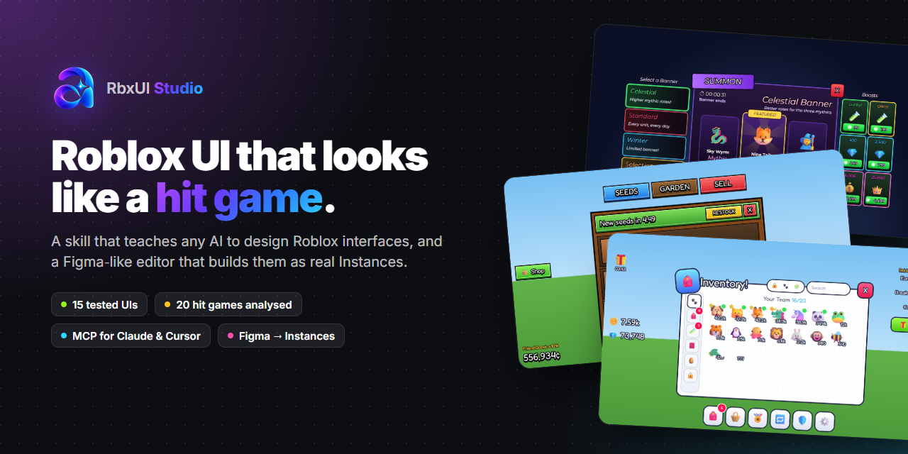
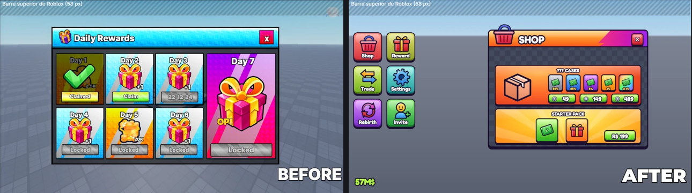
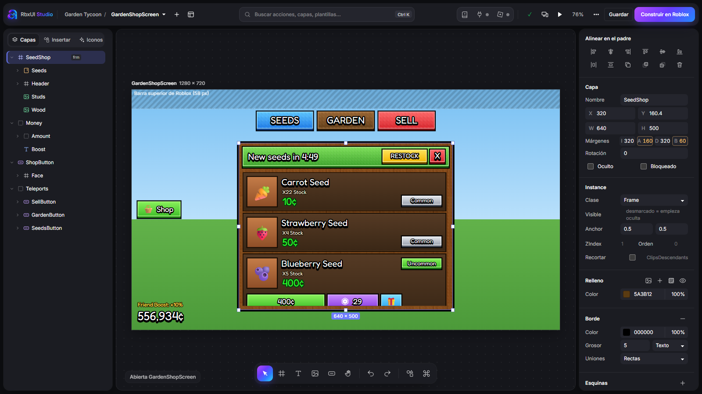
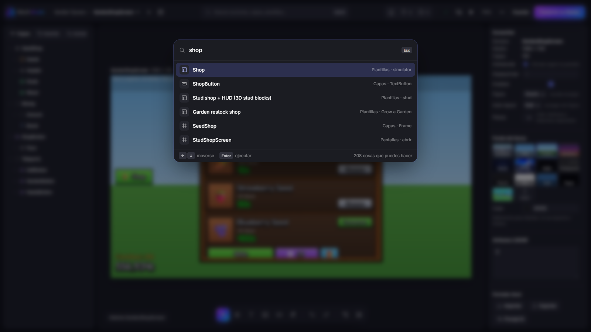
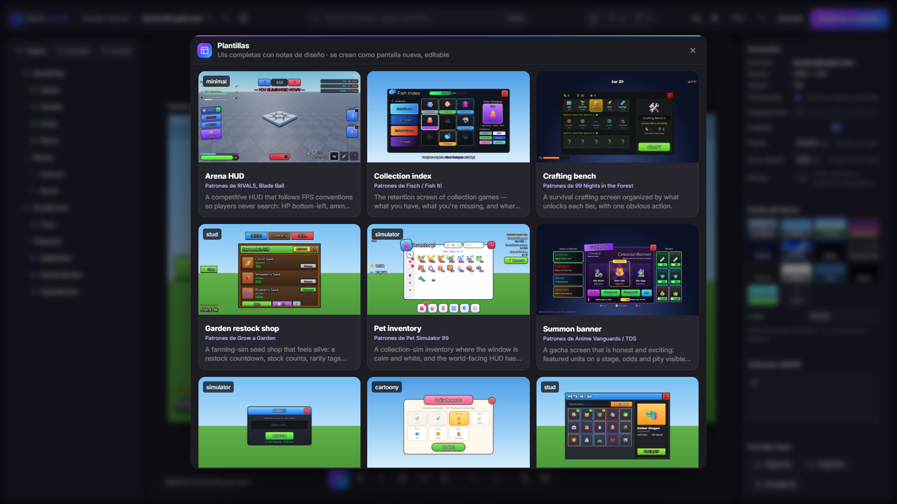
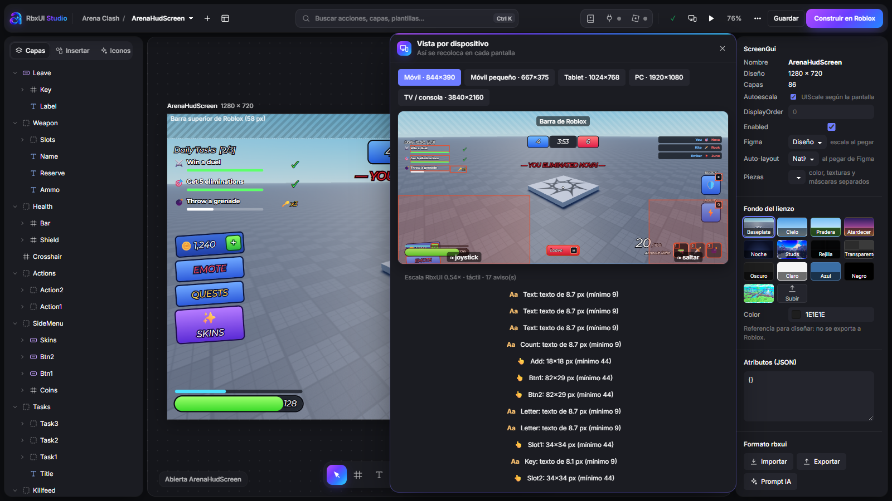
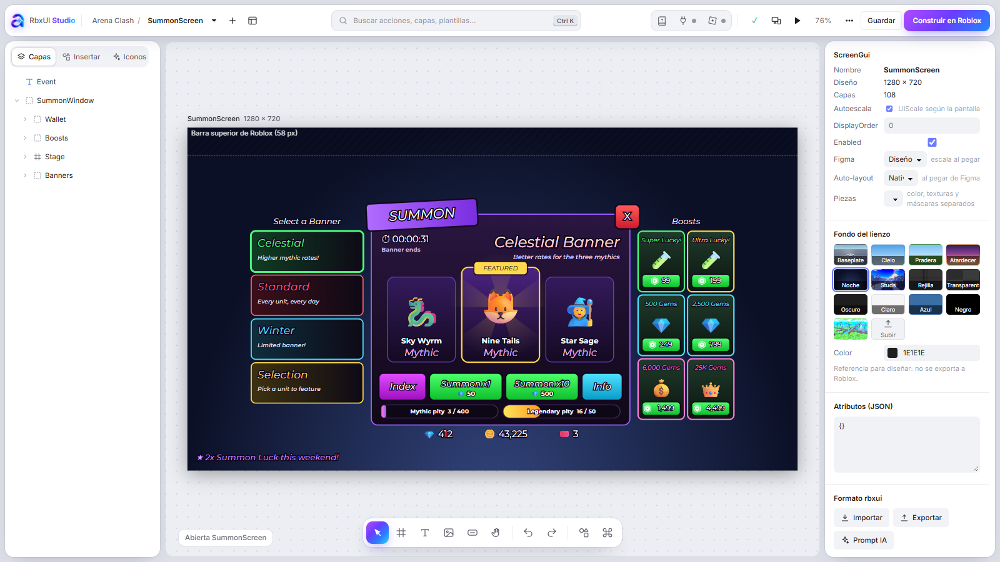
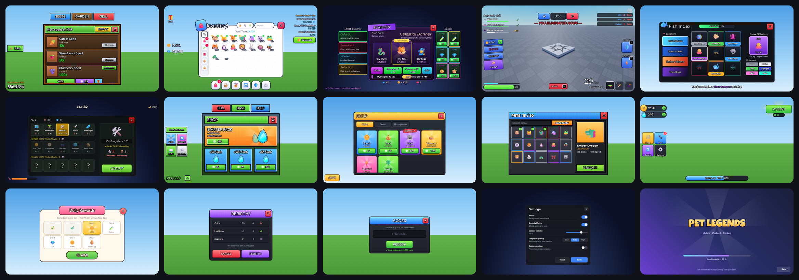

<p align="center"></p>

<p align="center">
<a href="https://github.com/MarkRuiz00/RbxUiStudio/actions/workflows/validate.yml"></a>
<a href="LICENSE"></a>
<a href="ejemplos/README.md"></a>
<a href="juegos/README.md"></a>
<a href="tool/README.md"></a>
</p>

<p align="center">
<b>Teach any AI to design Roblox UI like the top games — and build it as real Instances.</b><br>
A skill (knowledge pack) + <b>RbxUI Studio</b>, a Figma-like editor with an MCP server and a Roblox Studio plugin.
</p>

<p align="center">
<a href="#quick-start">Quick start</a> · <a href="SKILL.md">SKILL.md</a> · <a href="juegos/README.md">Hit-game teardowns</a> · <a href="ejemplos/README.md">Examples</a> · <a href="roblox-ui/README.md">Fundamentals</a> · <a href="estilos/README.md">Styles</a> · <a href="checklist.md">Checklist</a> · <a href="#español">Español</a>
</p>

---

## Why

Ask an AI for a Roblox shop and you usually get pixel offsets that break on phones, flat colors, no hierarchy and text nobody can read.
RbxUiStudio fixes it from both sides:

| | |
|---|---|
| 🧠 **Knowledge** | [`SKILL.md`](SKILL.md) + guides: engine fundamentals checked against [create.roblox.com/docs](https://create.roblox.com/docs), four style families, a final checklist, and **teardowns of 20 hit games** (Grow a Garden, Pet Simulator 99, Adopt Me!, Blox Fruits, RIVALS, DOORS…) with screen maps, sampled palettes and the 16 conventions they all share. |
| 🎨 **RbxUI Studio** | The AI writes a JSON tree of **real Roblox Instances** (`rbxui`), sees it exactly as Roblox lays it out, iterates on the render and installs it in Studio — images uploaded, no API key. Humans get a Figma-style editor on top of the same file. |
| 🧩 **15 example UIs** | Complete, validated screens with the design reasoning behind each — six of them built from the patterns of the most played games. Every one is also a **template** in the editor. |



## See it

<p align="center"></p>

<table>
<tr>
<td width="50%"><br><b>Ctrl+K command palette</b> — every action, tool, screen, layer, component and template in one search.</td>
<td width="50%"><br><b>Templates</b> — start from any of the 15 example UIs; it becomes a new, editable screen.</td>
</tr>
<tr>
<td><br><b>Device view</b> — the scene re-laid on phone, tablet, PC and TV, thumb zones marked, unreadable text and tiny tap targets flagged.</td>
<td><br><b>Dark & light</b> — floating panels, tool dock, dot-grid canvas, live check against the official Roblox API.</td>
</tr>
</table>

<details>
<summary><b>Everything the editor does</b></summary>

- **Real Instances, exact preview** — Frame, TextLabel, ImageButton, ScrollingFrame, UIStroke, UIGradient, UICorner, UIListLayout/GridLayout/Flex, AspectRatio/Size constraints, 9-slice (`SliceCenter`/`SliceScale`), `AutomaticSize`, AnchorPoint and Scale/Offset laid out like Roblox does.
- **Figma in, Roblox out** — copy layers in Figma, paste in the editor: auto-layout → `UIListLayout`, constraints → AnchorPoint, blend modes and textures → reusable tinted masks, prototypes → open/close interactions.
- **Design tools** — Alt to measure distances, margins check, fill stack with Overlay/Multiply/Screen on any layer, 3D stud blocks, icon search (Iconify) and your own logo folders.
- **Check as you go** — every property, enum and value validated live against the official API generated from [Roblox/creator-docs](https://github.com/Roblox/creator-docs).
- **Try it** — press **P** to click buttons and open windows; device view for phones/tablets/TV; QR to open it on your phone.
- **AI-native** — MCP server (`rbxui_design_guide`, `rbxui_put_scene`, `rbxui_render`, `rbxui_studio_install`…), your own Figma UIs as style references, a copy-paste flow for agents without MCP.
- **Ship** — the **RbxUI Connect** plugin installs the ScreenGui in Studio and uploads its images; or export Luau.
</details>

## Learn from hit games

[`juegos/`](juegos/README.md) breaks down how the most played Roblox experiences lay out their UI — written from real gameplay screenshots, with approximate sampled colors and no copied art.

| | Game | The one thing to learn |
|---|---|---|
| 🌱 | [Grow a Garden](juegos/grow-a-garden.md) | A restock timer + stock counts make a shop feel alive |
| 🐾 | [Pet Simulator 99](juegos/pet-simulator-99.md) | No boxes behind HUD numbers; icons break out of windows |
| 🧠 | [Steal a Brainrot](juegos/steal-a-brainrot.md) | Put the info in the world, keep the HUD tiny |
| 🎯 | [RIVALS](juegos/rivals.md) · [Blade Ball](juegos/blade-ball.md) | FPS conventions; one geometric trait (skew) everywhere |
| 🔦 | [DOORS](juegos/doors.md) · [99 Nights](juegos/99-nights.md) | Remove almost everything; tiered crafting with one big CRAFT |
| 🏠 | [Adopt Me!](juegos/adopt-me.md) · [Brookhaven](juegos/brookhaven.md) · [Dress to Impress](juegos/dress-to-impress.md) | Paper-card windows, icon-first menus, brand shapes |

…plus Blox Fruits, Anime Vanguards / TDS, Fisch / Fish It!, Bee Swarm, BedWars, Murder Mystery 2 and the Battlegrounds games.



## Quick start

### 1. RbxUI Studio (the tool)

```bash
git clone https://github.com/MarkRuiz00/RbxUiStudio.git
cd RbxUiStudio/tool
npm install
npm start
```

Open <http://localhost:5170/> → **Desde plantilla** to start from an example. Needs Node.js 20+ and Google Chrome (or `npm run browser` for Playwright's Chromium).
Textures used by the examples come from [ui-resources.com](https://ui-resources.com) and download on first use (`node tools/ui-resources.mjs fetch --examples` to get them all). Details: [tool/README.md](tool/README.md).

### 2. The skill

**Claude Code** — install the skill and the MCP server:

```bash
git clone https://github.com/MarkRuiz00/RbxUiStudio.git ~/.claude/skills/rbxui-studio
claude mcp add -s user rbxui -- node ~/.claude/skills/rbxui-studio/tool/studio/mcp.mjs
```

(The editor's **MCP** button can also register it for Claude Code, Claude Desktop and Cursor.)

**Claude.ai / Claude Desktop** — zip this folder and upload it as a custom skill (Settings → Capabilities → Skills; ⚠️ menu names may change). Add the MCP server to `claude_desktop_config.json`:

```json
{ "mcpServers": { "rbxui": { "command": "node", "args": ["/absolute/path/RbxUiStudio/tool/studio/mcp.mjs"] } } }
```

**Other agents (Cursor, Codex, Gemini CLI, Copilot…)** — point your rules/`AGENTS.md` at `SKILL.md` ("Before designing Roblox UI, read SKILL.md and follow it") and add the same MCP server. No MCP? Use the copy-paste flow: [rbxui/without-mcp.md](rbxui/without-mcp.md).

### 3. Roblox Studio

Editor → **Studio** → install the **RbxUI Connect** plugin, open your place, allow HTTP to localhost. Then `rbxui_studio_install` puts the UI in `StarterGui`.

## How an AI uses it

```
read SKILL.md ─► juegos/ (genre conventions) ─► rbxui_design_guide ─► write rbxui JSON
      ─► rbxui_put_scene ─► rbxui_render ─► look, fix, repeat ─► checklist ─► rbxui_studio_install
```

Every engine fact links to the official docs; anything unconfirmed is marked **⚠️ unverified**. [`tools/validate.mjs`](tools/validate.mjs) checks UIs against the official Roblox API (classes, writable properties, enum names, value shapes) and runs on every push.

## Repo map

| Path | |
|---|---|
| [SKILL.md](SKILL.md) | Entry point: golden rules + workflow |
| [juegos/](juegos/README.md) | UI teardowns of 20 hit games + 16 shared conventions |
| [roblox-ui/](roblox-ui/README.md) | Engine fundamentals (UDim2, AnchorPoint, layouts, 9-slice, safe area, text, responsive…) |
| [estilos/](estilos/README.md) | Style guides + [resources](estilos/resources.md) (ui-resources.com index) |
| [rbxui/](rbxui/README.md) | How to do everything in rbxui (format, MCP tools, editor, Figma import, recipes, mistakes) |
| [ejemplos/](ejemplos/README.md) | 15 example UIs (JSON + design notes + renders) |
| [checklist.md](checklist.md) | Final verification before shipping a screen |
| [tool/](tool/README.md) | RbxUI Studio (editor, MCP server, Studio plugin, runtime) |
| [tools/](tools/) | `validate.mjs`, `ui-resources.mjs`, `build-roblox-api.mjs` |

## Contributing

Wanted: teardowns of more games, new example UIs, style guides for more genres, fact fixes with doc links, translations and editor features.
Read [CONTRIBUTING.md](CONTRIBUTING.md) — short version: verify facts against the official docs, run `node tools/validate.mjs examples`, never commit third-party or game art (link it with credit).

## License

[MIT](LICENSE) © 2026 RbxUiStudio. Third-party resources linked from `estilos/resources.md` belong to their authors. Game names in `juegos/` belong to their owners and are used for commentary; no game art is included.
Roblox API data derived from Roblox/creator-docs (CC BY 4.0). Roblox is a trademark of Roblox Corporation; this project is not affiliated with Roblox.

---

## Español

**RbxUiStudio** enseña a cualquier IA a diseñar interfaces de Roblox como las de los juegos más jugados y a construirlas como Instances reales con **RbxUI Studio**, un editor tipo Figma.

- **Qué incluye:** la skill (`SKILL.md` + guías en inglés: fundamentos verificados con la documentación oficial, estilos, checklist), **análisis de la UI de 20 juegos top** en [`juegos/`](juegos/README.md) (Grow a Garden, Pet Simulator 99, Adopt Me!, Blox Fruits, RIVALS, DOORS…), el editor RbxUI Studio (servidor MCP y plugin de Roblox Studio) y **15 UIs de ejemplo** que también son plantillas.
- **El editor:** paneles flotantes, barra de herramientas abajo, paleta de comandos con **Ctrl+K**, plantillas, vista por dispositivo (móvil, tablet, PC, TV), medir con Alt, comprobación en vivo contra la API oficial, pegar desde Figma, tema claro y oscuro.
- **Instalar la herramienta:** `cd tool && npm install && npm start` → <http://localhost:5170/> → **Desde plantilla**. Requiere Node 20+ y Chrome.
- **Instalar la skill en Claude Code:** clona el repo en `~/.claude/skills/rbxui-studio` y registra el MCP con `claude mcp add -s user rbxui -- node <ruta>/tool/studio/mcp.mjs` (o con el botón **MCP** del editor).
- **Claude.ai / otros agentes:** sube la carpeta como skill o apunta tus reglas a `SKILL.md`; sin MCP puedes copiar y pegar el JSON en el editor.
- **Roblox Studio:** botón **Studio** del editor → instalar el plugin **RbxUI Connect** → la IA instala la UI en `StarterGui` y sube las imágenes sin API key.
- **Contribuir:** lee [CONTRIBUTING.md](CONTRIBUTING.md). Hechos con enlace a la doc oficial, ejemplos que pasen `node tools/validate.mjs examples` y nada de arte de terceros ni de juegos dentro del repo.

La interfaz del editor está en español; la documentación de la skill, en inglés para llegar a más gente.
