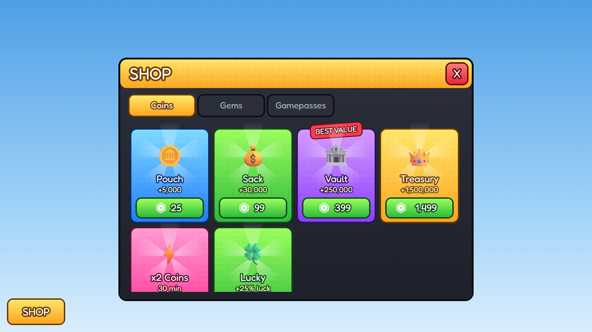
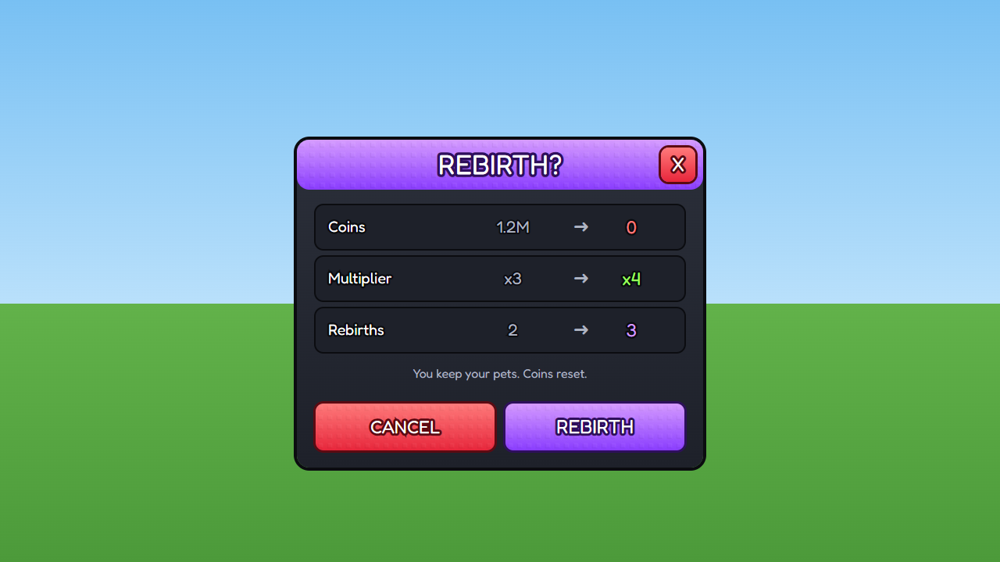
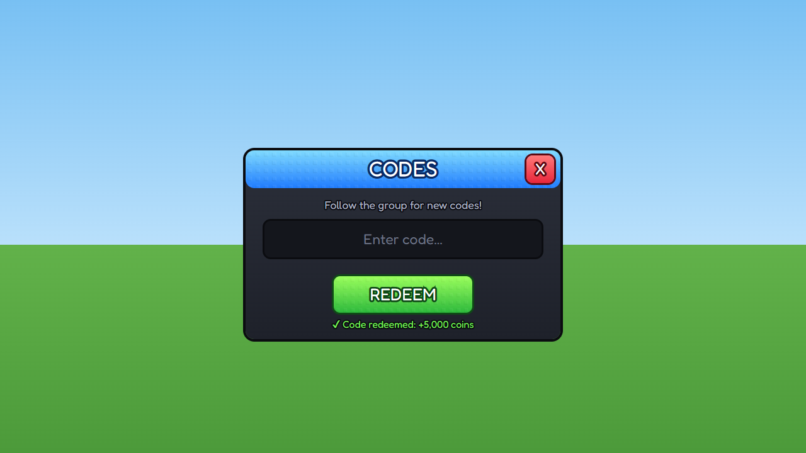
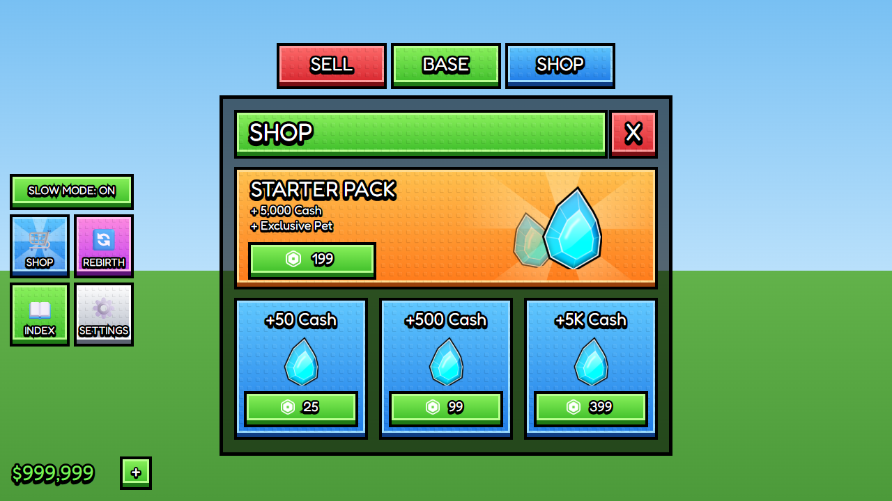
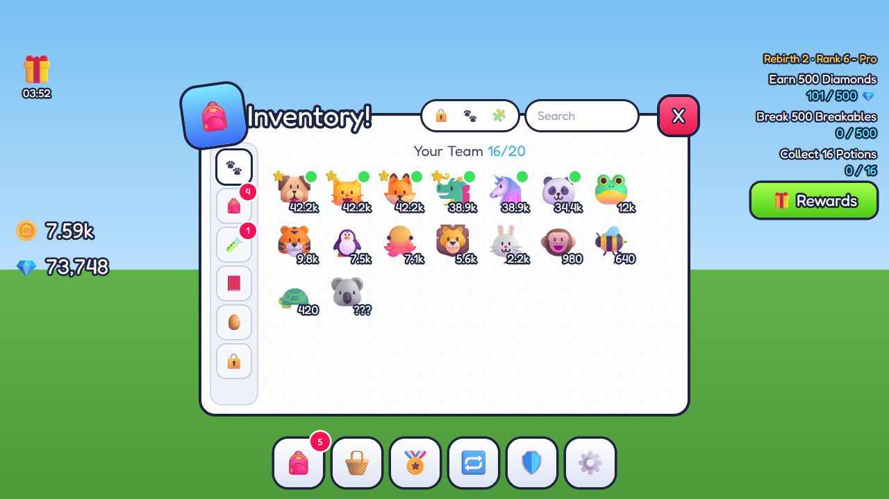
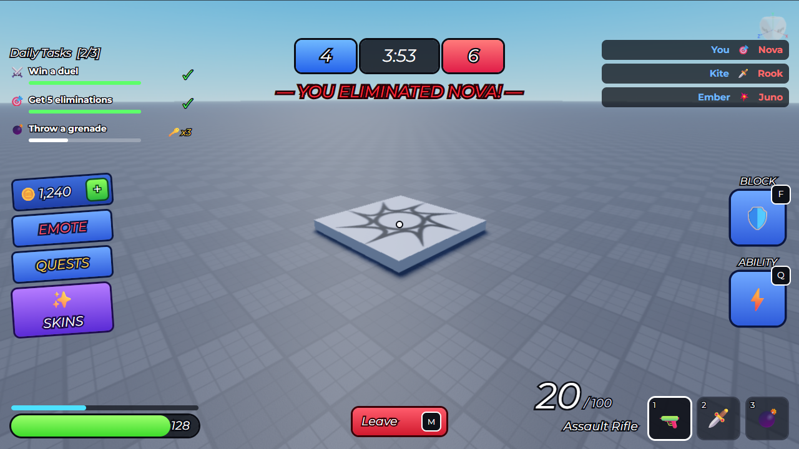
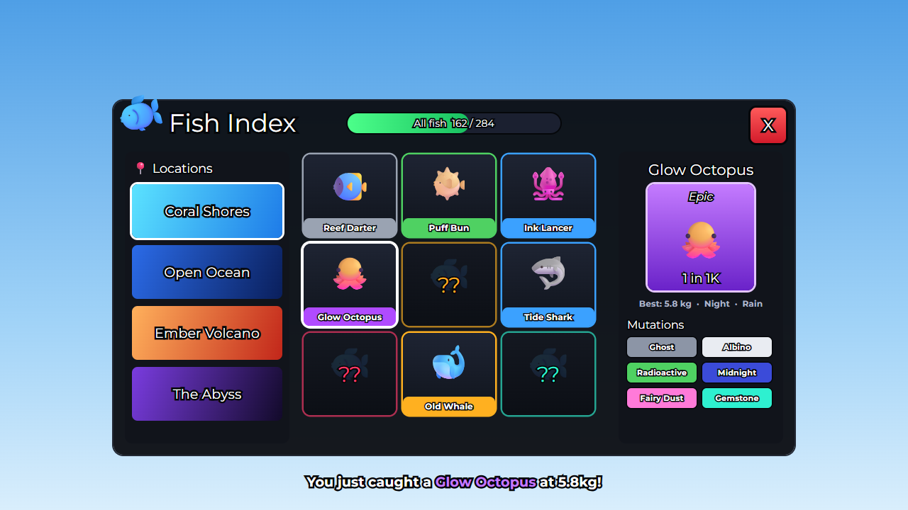

# Examples

Complete UIs in rbxui format. Every file passes `node tools/validate.mjs examples` (official Roblox API check + import + render in RbxUI Studio).
Open one in the editor: Ctrl+V its JSON, or `rbxui_put_scene` it through the MCP. Textures come from ui-resources.com:
run `node tools/ui-resources.mjs fetch --examples` once so the editor can show them.

| Example | Style | Shows | Render |
|---|---|---|---|
| [Simulator HUD](simulator-hud.md) | simulator | currency pills, 2×2 side menu with badge, boost button with sunburst, XP bar |  |
| [Shop](shop.md) | simulator | window + header + tabs, scrolling grid of product cards, Robux prices, open/close interactions |  |
| [Inventory](inventory.md) | stud | square/black-stroke look, search TextBox, rarity-colored slots, details panel |  |
| [Settings](settings.md) | minimal | toggles, slider, segmented control, rows with dividers |  |
| [Loading screen](loading-screen.md) | minimal | full-screen overlay, gradient title, progress bar, `IgnoreGuiInset` |  |
| [Daily reward](daily-reward.md) | cartoony | 7-day grid, claimed/today/locked states, ribbon title |  |
| [Rebirth popup](rebirth-popup.md) | simulator | confirmation popup, before → after stats, flex buttons |  |
| [Codes](codes.md) | simulator | TextBox input, redeem button, status message |  |
| [Stud shop + HUD](stud-shop-hud.md) | stud (3D blocks) | 3D stud blocks (face + lip + outer stroke), 3D text, teleport buttons, hero offer + dev products — from a Figma tutorial |  |

### Inspired by hit games

Built from the patterns in [../juegos/](../juegos/README.md) — original art, same ideas.

| Example | Patterns from | Shows | Render |
|---|---|---|---|
| [Garden restock shop](garden-shop.md) | Grow a Garden | teleport tabs, restock timer, stock rows, rarity blocks, expandable buy row (coins · Robux · gift) |  |
| [Pet inventory](pet-inventory.md) | Pet Simulator 99 | white window, breaking title icon, category rail, tile-less grid, box-less HUD, menu with badges |  |
| [Arena HUD](arena-hud.md) | RIVALS, Blade Ball | score + timer, killfeed, tasks, tilted menu, BLOCK/ABILITY with key badges, HP and ammo |  |
| [Summon banner](summon-banner.md) | Anime Vanguards | banner list, slanted header, featured units, summon x1/x10, pity bars, boost offers |  |
| [Crafting bench](crafting-bench.md) | 99 Nights in the Forest | tiered sections, locked/unknown tiles, costs in red, details pane, CRAFT |  |
| [Collection index](collection-index.md) | Fisch / Fish It! | progress, location filter, `??` missing entries, rarity card with odds, mutations |  |

**Icons:** the emoji glyphs (🛒 🐾 🪙…) are placeholders so the examples work without third-party art. Replace them with
`ImageLabel`s of your own icon set (editor → Iconos → Online, or the packs in [../estilos/resources.md](../estilos/resources.md)).
Roblox renders emoji with its own font, so they look different in-game.
