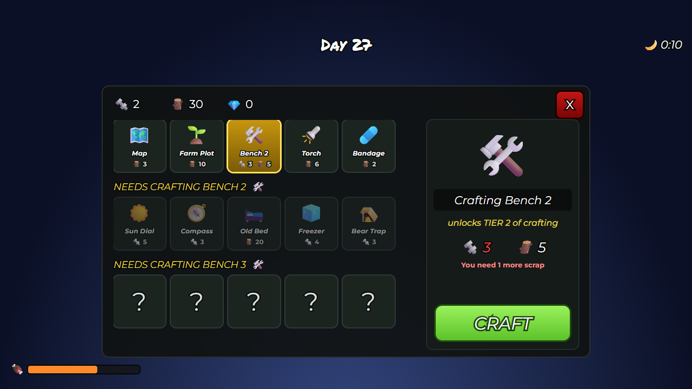

# Crafting bench

 · JSON: [crafting-bench.rbxui.json](crafting-bench.rbxui.json) · Style: dark minimal ·
Patterns from: [99 Nights in the Forest](../juegos/99-nights.md)

**Purpose:** a survival crafting screen organized by what unlocks each tier, with one obvious action.

## What to notice

| Element | How it's built | Why |
|---|---|---|
| Resources | icon + number row at the top-left of the window | the budget is always in view |
| Sections | each section is a `Frame` with `AutomaticSize = Y` holding a header and a `UIGridLayout` | sections grow with their recipes; the outer list stacks them |
| Tier headers | yellow heavy italic caps `NEEDS CRAFTING BENCH 2 🛠️` | the requirement is the title |
| Locked tiles | background 0.45 transparent, text and icon 0.5 transparent | visible but clearly unavailable |
| Unknown tiles | big `?` | curiosity for the next tier |
| Selected tile | gold gradient + yellow stroke | one selection, high contrast |
| Details | big icon, name plate, italic yellow description, costs (red when you can't afford), helper line | the "why can't I craft" answer is on screen |
| `CRAFT` | full-width lime button, 64 px tall | the one action |
| HUD | `Day 27` in Permanent Marker, moon timer, hunger bar | handwritten accent = survival mood |
