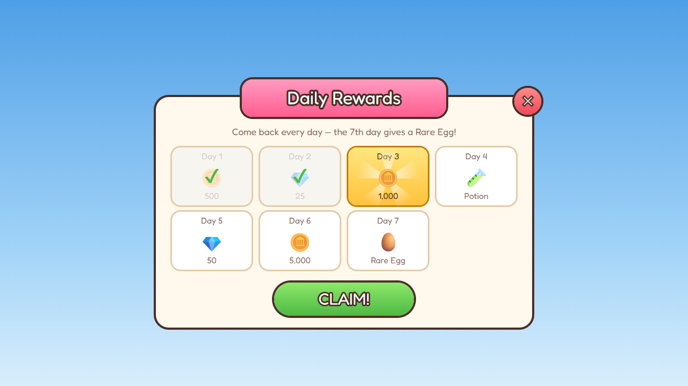

# Daily reward

 · JSON: [daily-reward.rbxui.json](daily-reward.rbxui.json) · Style: [cartoony](../estilos/cartoony.md)

**Purpose:** bring players back every day; make today's reward feel special and the streak goal visible.

## Layout decisions
- **Three states, three looks:** claimed = faded + green check overlay; today = gold gradient + sunburst + darker stroke; locked = white card. No legend needed.
- **7-day `UIGridLayout`** (148×108 cells, centered block): the big prize (Day 7: Rare Egg) is named in the subtitle so the goal is explicit.
- **Ribbon title** overlapping the panel's top edge and a round close button on the corner — playful, cartoony silhouette.
- **One big pill CTA** (`CLAIM!`, 260×62) in green.

## Cartoony style specifics
Cream panel `#FFF8EC`, warm brown `#4A2F27` for strokes and text instead of black, radius 16–24, pills for buttons, `FredokaOne`.

## Wiring
Server stores the last claim time and streak (DataStore). On join, show the popup if a claim is available; on `Claim` fire a RemoteEvent, then mark `Day N` as claimed and play a coin burst.
