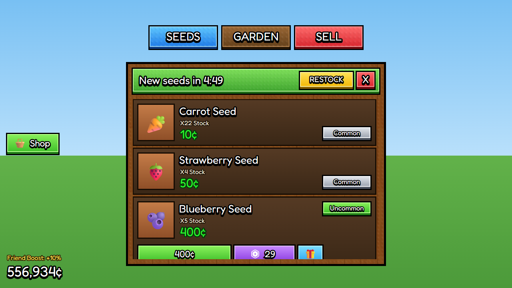

# Garden restock shop

 · JSON: [garden-shop.rbxui.json](garden-shop.rbxui.json) · Style: [stud](../estilos/stud.md) ·
Patterns from: [Grow a Garden](../juegos/grow-a-garden.md)

**Purpose:** a farming-sim seed shop that feels alive: a restock countdown, stock counts, rarity tags and a row that expands into
three ways to pay. Original art (emoji placeholders), wood + stud textures from ui-resources.com.

## What to notice

| Element | How it's built | Why |
|---|---|---|
| `SEEDS · GARDEN · SELL` teleports | three 3D stud blocks in a horizontal `UIListLayout`, each its own color | navigation = destination colors ([convention 16](../juegos/README.md#16-conventions-almost-every-hit-shares)) |
| Window | wood `Frame` + tiled wood texture tinted with `ImageColor3` + faint studs, 5 px **Outer** black stroke, **no corner radius** | classic stud look |
| Header | green 3D block with `New seeds in 4:49`, yellow `RESTOCK` (Robux) and red `X` inside | the timer turns a static list into an event |
| Rows | `ScrollingFrame` + vertical `UIListLayout`, `AutomaticCanvasSize = Y` | add rows without touching positions |
| Row content | icon well · name (3D text) · `X22 Stock` · green price · rarity block | everything a buyer needs in one glance |
| Sold out | `NO STOCK` in red, row stays visible | players see what they're missing |
| Expanded row | `BuyRow`: coins (green), Robux (purple, with the Robux glyph), gift (blue) | three ways to pay, gift always next to Robux |
| HUD money | 3D text bottom-left, **no panel**, `Friend Boost` above it | HUD numbers don't need boxes |

## Script hooks

- `SeedShop.Header.Timer.Text` ← your restock countdown (update once per second).
- Each row is named after the seed (`CarrotSeed`, `BlueberrySeed`…): clone one row as a template for your seed list.
- Toggle a row's `BuyRow` and its `Size.Y` (112 ↔ 176) to expand/collapse.
