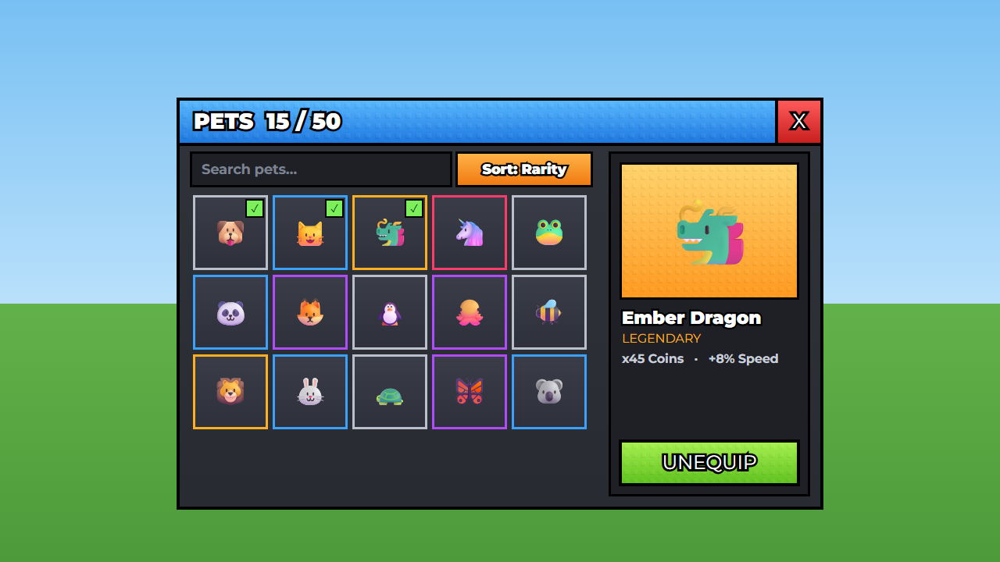

# Inventory

 · JSON: [inventory.rbxui.json](inventory.rbxui.json) · Style: [stud](../estilos/stud.md)

**Purpose:** browse, inspect and equip pets.

## Layout decisions
- **Two panes:** grid on the left (what I have), details on the right (what this one does). Selection on the left updates the right — no extra popups.
- **Toolbar** above the grid: search `TextBox` (placeholder text, `ClearTextOnFocus: false`) + sort button.
- **Slots 90×90** in a scrolling `UIGridLayout`; the **stroke color is the rarity** (gray/blue/purple/gold/red) so rarity reads at a glance without labels.
- **Equipped marker:** small lime square with a check in the slot corner.
- **Count in the title** (`PETS 15 / 50`) — capacity is a key motivator.

## Stud style specifics
- No `UICorner` anywhere; black `UIStroke` 3–4 px with `LineJoinMode: "Miter"`.
- Header blue with studs; close button = red square flush in the header corner.
- `Montserrat` Heavy/Black text with a black outline.
- Primary action **lime**, studded, full width at the bottom of the details panel.

## Phones
Both panes keep their pixel sizes under auto-scale; on very narrow screens hide the details pane and open it as a popup on tap.

## Wiring
Clone `Slot1` as a template per pet (`LayoutOrder` = rarity order), set `Icon` and stroke color; fire a RemoteEvent on `Equip`.
