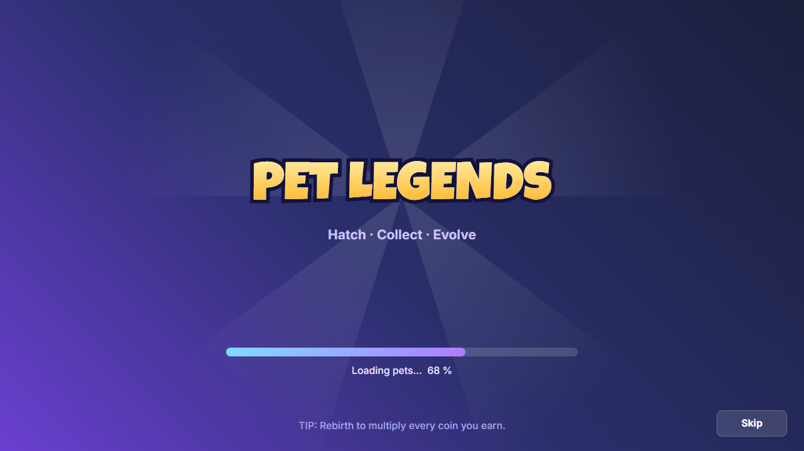

# Loading screen

 · JSON: [loading-screen.rbxui.json](loading-screen.rbxui.json) · Style: [minimal](../estilos/minimal.md)

**Purpose:** cover asset loading with the game's brand and honest progress.

## Layout decisions
- **Its own ScreenGui** with `DisplayOrder: 100` (above everything), `IgnoreGuiInset: true` and `ScreenInsets: "None"` so the background covers the whole screen including the top-bar area. Only non-interactive content goes edge-to-edge; the Skip button stays inside the safe margins.
- **Title at 40 % height** with a gold `UIGradient` on the text and a thick dark outline — the only loud element.
- **Thin progress bar** (14 px) + status text with a percentage; a rotating sunburst at 0.9 transparency adds motion without noise.
- **Tip line** at the bottom teaches a mechanic while waiting.

## Wiring
Use `ContentProvider:PreloadAsync` over your key assets and update `Progress.Fill.Size` / `Status.Text`; fade the whole ScreenGui out (`GroupTransparency` via a `CanvasGroup`, or tween each element) and set `Enabled = false`.
Use `ReplicatedFirst` + `ReplicatedFirst:RemoveDefaultLoadingScreen()` to show it as early as possible (Roblox API).
