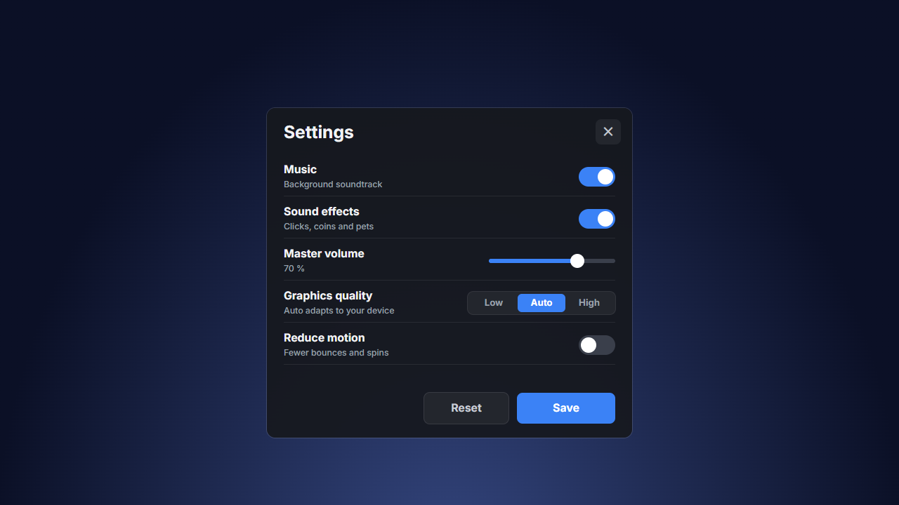

# Settings

 · JSON: [settings.rbxui.json](settings.rbxui.json) · Style: [minimal](../estilos/minimal.md)

**Purpose:** let players change audio/graphics/motion quickly and confidently.

## Layout decisions
- **Rows of 56 px** in a vertical `UIListLayout`: label + one-line hint on the left, control on the right, 1 px divider at 8 % opacity.
- **Controls match the data:** toggle for on/off, slider for a range, segmented control for 3 options (`HorizontalFlex: "Fill"` so segments share the width).
- **Accent = one blue** (`#3B82F6`) for "on", the active segment, slider fill and the primary button. Everything else is neutral.
- **Actions bottom-right:** primary `Save` filled, secondary `Reset` outlined.
- **"Reduce motion"** setting — respect players sensitive to big animations (see [../roblox-ui/animation.md](../roblox-ui/animation.md)).

## Minimal style specifics
`BuilderSans` (Bold titles, Medium hints), sizes 28 / 18 / 14; surfaces `#16181D` with 1 px white strokes at ~0.88 transparency; radius 8–12; no textures.

## Wiring
Toggles: tween `Knob.Position`/`AnchorPoint` and background color on click; save with a RemoteEvent → DataStore. Apply graphics changes client-side.
