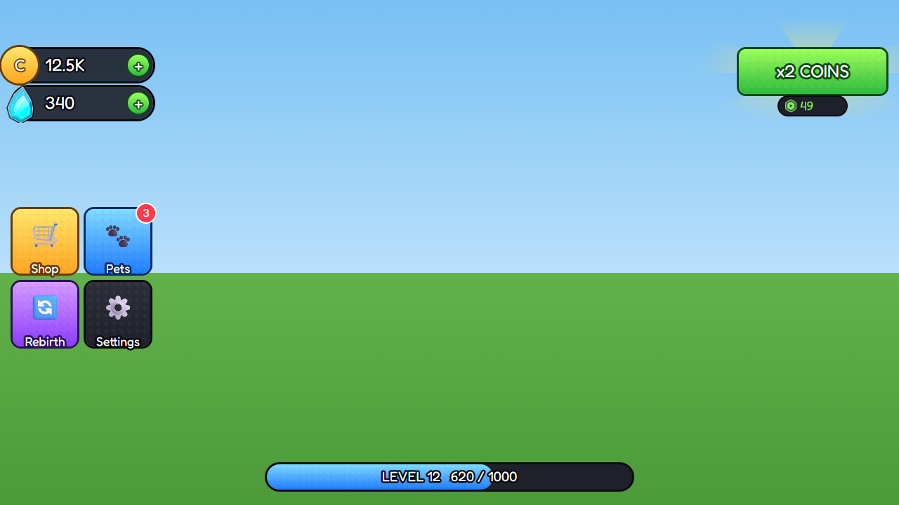

# Simulator HUD

 · JSON: [simulator-hud.rbxui.json](simulator-hud.rbxui.json) · Style: [simulator](../estilos/simulator.md)

**Purpose:** the always-visible layer of a pet/clicker simulator: what I have (currencies), where I go (side menu), what I'm working toward (XP bar), and one monetized offer.

## Layout decisions
- **Currencies top-left, under the top bar** (`Position [0,18,0,70]`): the conventional place players scan first; the 58 px top-bar band stays empty.
- **Side menu left-middle** (`AnchorPoint [0,0.5]`, `Position [0,18,0.55,0]`): reachable by the left thumb on phones, out of the bottom-left thumbstick zone.
- **2×2 `UIGridLayout`** with 92 px cells: equal targets well above 44 px; adding a 5th button just appends.
- **XP bar bottom-center** (`AnchorPoint [0.5,1]`): between the thumbstick and jump zones, never under a thumb.
- **Boost offer top-right**: visible but not in the play area; sunburst behind it (tinted white texture) draws the eye without extra color.

## Visual system
- Every colored piece = white `BackgroundColor3` + vertical `UIGradient` (light → dark) + dark `UIStroke` 3 px + tiled stud texture at 0.84 transparency.
- One family per meaning: gold = coins/shop, blue = pets/gems, purple = rebirth, dark = settings, green = buy.
- `FredokaOne` with a dark outline on all text; numbers use suffixes (`12.5K`).
- Red notification badge (`Pets` → 3) only where there's something to claim.

## Phones
Designed on 1280×720 with `autoScale` on; top-level children use Scale positions + AnchorPoint so they stay pinned to their corners on any aspect ratio.

## Wiring
Give `SideMenu.Shop` an interaction to open the shop window: `"interactions":[{"trigger":"click","action":"toggle","target":"ShopWindow","animation":"pop"}]`
(the target can live in another ScreenGui — the runtime searches all of them). Update `Coins.Amount.Text` / `XPBar.Fill.Size` from your scripts.
