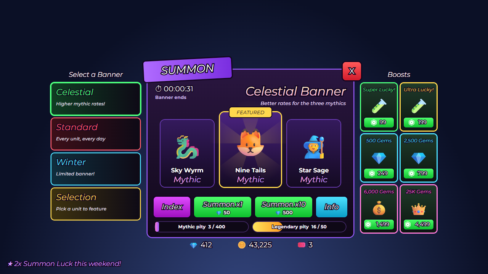

# Summon banner

 · JSON: [summon-banner.rbxui.json](summon-banner.rbxui.json) · Style: neon dark ·
Patterns from: [Anime Vanguards / TDS](../juegos/tower-defense.md)

**Purpose:** a gacha screen that is honest and exciting: featured units on a stage, odds and pity visible, two big summon buttons.

## What to notice

| Element | How it's built | Why |
|---|---|---|
| Banner list | 4 cards with a dark gradient and a colored `UIStroke` (Border); the selected one is thicker | each banner owns a color |
| `SUMMON` plate | a purple `Frame` rotated −3° that overlaps the stage edge (`ZIndex 2`) | slanted headers = genre identity |
| Banner name | `TextLabel` with a `UIGradient` (cream → pink) **and** a dark `UIStroke` | gradient text that stays readable |
| Featured units | 3 cards in a bottom-aligned horizontal list; the middle one is bigger, gold-stroked, with a sunburst and a `FEATURED` tag | hierarchy by size |
| Rarity word | `Mythic` with a pink → purple gradient | rarity is read by color first |
| Buttons | `Index` magenta · `Summon x1` / `x10` green with the cost under the label · `Info` cyan | cost visible before tapping |
| Pity bars | two thin labeled bars (`3 / 400`, `16 / 50`) | trust: players see the guarantee |
| Boosts | 2-column grid of offers with a Robux price pill | upsell next to the action, not in a popup |

## Notes

- Rotated frames are not clipped by `ClipsDescendants`; keep rotated decorations outside clipping containers.
